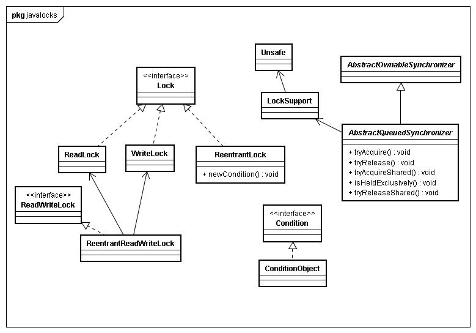

# 同步器

AbstractQueuedSynchronizer & AbstractQueuedLongSynchronizer

Lock基础(Lock的实现类通过内部类继承同步器，根据Lock用途具体实现)，JUC 锁机制都是基于 AQS 框架上构建的

同步器**通过共享状态来同步**（只有当状态满足xxx条件，才触发线程执行）:
1. 获取同步状态（如果允许，获取锁，否则，阻塞线程直到同步状态允许获取）
2. 释放同步状态（修改同步状态，并唤醒等待线程）

