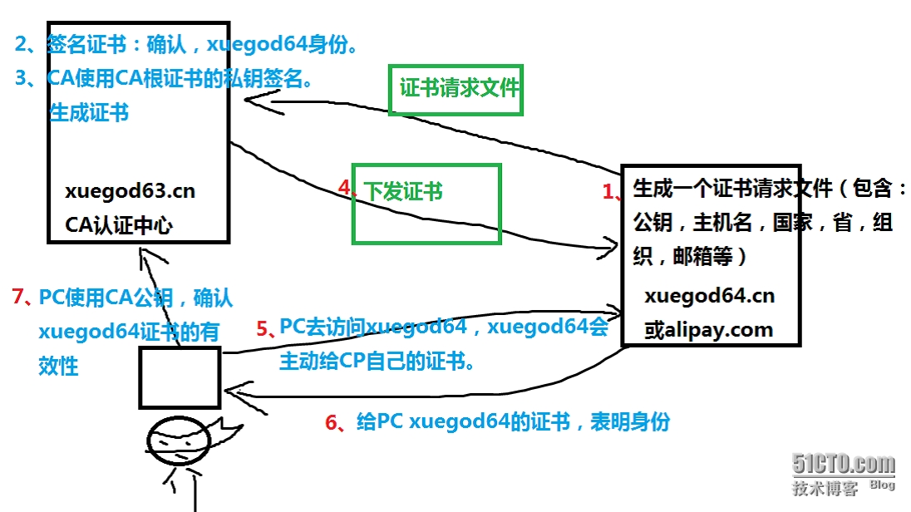
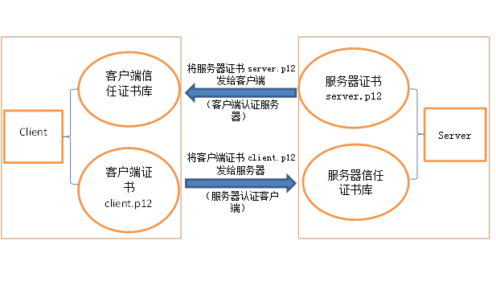

# CA（Certificate Authority）证书授权中心

PKI: Public Key Infrastructure
---------------
解决开放式互联网络信息安全需求的一套体系。PKI的核心是认证中心（CA），其发放数字证书。PKI的核心技术基础是公钥密码学的加密和签名技术。 

**证书内容**：一个公开密钥、名称以及证书授权中心的数字签名。一般情况证书还包括密钥的有效时间、发证机关的名称、该证书的序列号等信息。证书格式遵循ITUT X.509国际标准。 
**证书作用**：1. 加密通信 2. 身份验证 3.数据完整性 
**数字认证原理**：采用公钥体制（利用一对互相匹配的密钥进行加密、解密）公钥由本人公开，为一组用户共享，用于加密（非对称加密，公开密钥，代表算法：RSA）和验证签名。私钥仅为本人所知，用于解密和签名。

**数字签名**：采用公钥体制，防止他人对传输文件进行破坏以及确定发信人的身份。

> **通常一个用户拥有两个密钥对：一个密钥对用来对数字签名进行加密解密，一个密钥对用来对私有密钥进行加密解密。** 
  **数字签名的加密解密过程**：使用发送方的密钥对，发送方私钥进行加密，接收方使用发送方公开密钥进行解密,保证信息是由他发送的 
  **私有密钥的加密解密过程**：使用接收方的密钥对，发送方接收方的公钥进行加密，接收方私钥进行解密,保证信息只能他看到（安全传输）
**数字证书**：由证书认证机构（CA）对证书申请者真实身份验证后，使用CA根证书对申请人的一些基本信息以及申请人的公钥进行签名后形成的数字文件（使用CA根证书，包含公钥，CA私钥）。CA完成签发证书后，会将证书发布到CA证书库（目录服务器）任何人可以查询下载。

证书签发机构：1. 公共CA机构 2. 私有CA 3.自签名 

**自签名证书**：**需要通信的双方都要安装证书**，此双方互动。

使用CA证书认证服务身份过程
------------

自签发证书认证过程
----------

