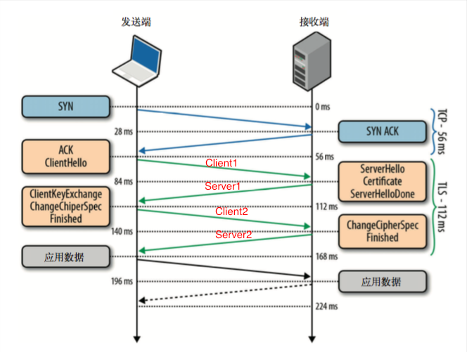

# TLS（Transport Layer Security）传输层安全协议

**基本思路**：公钥加密（客户端先向服务器端索要公钥[公钥放在数字证书中]，然后用公钥加密信息，服务器收到密文后，用自己的私钥解密） 
TLS 由 SSL 演化而来（SSL2.0 --> SSL3.0 --> TLS1.0），位于TCP和应用层之间

TLS 主要提供三个基本服务
1. 内容加密
2. 身份验证
3. 消息完整性校验

TLS握手

* 客户端发出请求
  * 1.支持的协议版本，如TLS1.0
  * 2.客户端生成的随机数，稍后用于生成“对话密钥”
  * 3.支持的加密算法，如RSA公钥加密
  * 4.支持的压缩方法
* 服务端回应请求
  * 1.确认使用加密通信协议版本
  * 2.服务器生成随机数，稍后用于生成“对话密钥”
  * 3.确认使用的加密算法
  * 4.服务器证书
* 客户端回应
  * 1.先验证服务器证书
  * 2.从证书中取出服务器的公钥
  * 3.服务器发送信息
    * 1.一个随机数，用于服务器公钥加密，防止被窃听
    * 2.编码改变通知，表示随后的信息都将用双方商定的加密方法和密钥发送
    * 3.客户端握手结束通知，表示客户端的握手阶段已经结束。这一项同时也是前面发送的所有内容的hash值，用来供服务器校验。
* 服务器回应
  * 收到客户端的第三个随机数pre-master key后，计算生成本次会话所用的“会话密钥”
  * 客户端发送信息
    * 编码改变通知，表示随后的信息都将用双方商定的加密方法和密钥发送
    * 服务器握手结束通知，表示服务器的握手阶段已经结束。这一项同时也是前面发送的所有内容的hash值，用来供客户端校验
* 握手结束，客户端服务器进入加密通信
