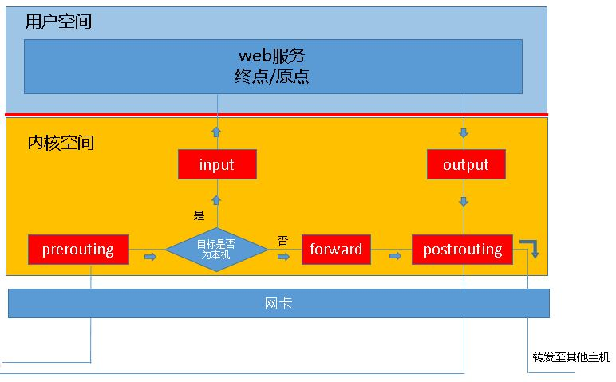
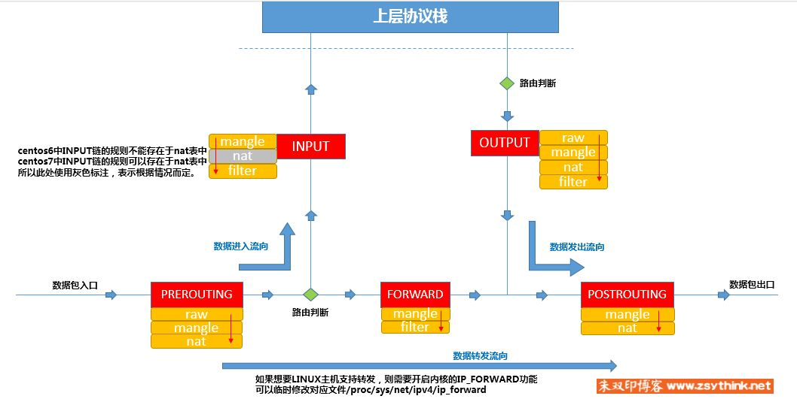

# iptables

iptables 没有守护进程，内核提供的功能 
类似客户端代理，真正防火墙安全框架是netfilter（位于内核空间） 
完成封包过滤、封包重定向和网络地址转换NAT等功能 

规则
------
规则存储在内核空间的信息包过滤表中，规则分别指定了源地址、目标地址、传输协议（如TCP、UDP、ICMP）和服务类型（如HTTP、FTP和SMTP）等 
当数据包和规则匹配时，iptables根据规则定义方法处理数据包（如Accept、reject、drop等）

表
----
相同功能规则的集合,**每条链上会按照表顺序进行匹配** 
iptables定义了4种表：
1. filter表：负责过滤功能，防火墙
2. nat表：network address translation，网络地址转换功能，源、目的地址及端口转换使用规则
3. mangle表：拆解报文，做出修改，并重新封装（为数据包设置标记，较少使用）
4. raw表：关闭nat表上启用的连接追踪机制（是否对该数据包进行状态跟踪）

链表关系
------
|        |PREROUTING|INPUT|FORWARD|OUTPUT|POSTROUTING|
|--------|----------|-----|-------|------|-----------|
|filter表|          |  *  |   *   |   *  |           |
|nat表   |     *    |     |       |   *  |     *     |
|mangle表|     *    |  *  |   *   |   *  |     *     |
|raw表   |     *    |     |       |   *  |           |
> 同一链上的表优先级（由高到低）：raw,mangle,nat,filter

自定义链
-------
自定义链不能直接使用，只能被某个默认链当做动作去调用才能起作用 

数据包在防火墙下的流程
-----------

