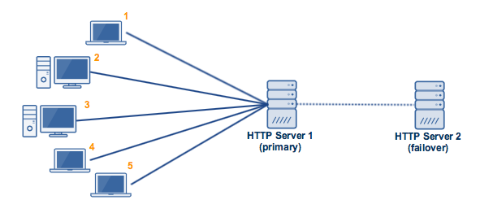
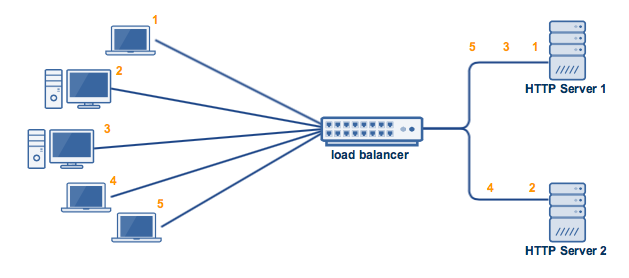

# active-active 和 active-passive

active-passive（单活）
----------
一主一备(容灾)造成浪费，备中心接替主中心需要时间较长、关系复杂，影响业务

active-active（双活）
------------
（容灾，负载均衡）提升了业务连续性，牺牲了备份作用，如果两个服务器同时宕机

两地三中心（生产数据中心、同城灾备中心、异地灾备中心）
---------------------------

分布式多活数据中心
---------------
