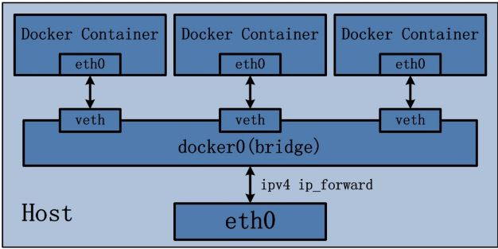

# 网桥驱动

|User-defined bridge|Default bridge|
|-------------------|--------------|
|连接到自定义网桥上的容器互相自动的暴露所有端口，而没有对外端口暴露|需要-p或--publish暴露端口|
|容器能通过名字或者别名互相访问|除非用--link选项，或者配置/etc/hosts（不方便debug），否则容器只能通过IP地址访问|
|容器生命周期内可以连接断开自定义网络|需要停止容器重新创建一个新的网络选项|
|根据应用程序组的不同网络需求，单独配置网桥|可以配置，但所有容器都使用相同设置（如：MTU，iptables规则），配置默认网桥需要重启Docker|
|共享环境变量通过1.挂载卷2.docker-compose文件指定3.swarm服务|共享变量通过--link选项|
|可以启用禁止IPv6|不能禁止IPv6|
||通过daemon.json可以配置默认网桥|

启用转发，容器连接外界
------------------
1. `sysctl net.ipv4.conf.all.forwarding=1`配置linux内核允许IP转发
2. `sudo iptables -P FORWARD ACCEPT`改变iptables FORWARD策略DROP为ACCEPT

访问过程
---------
* 外界访问容器
  1. 外界访问宿主机IP+port
  2. 宿主机接收请求后，由DNAT规则，将请求的目的IP和port进行转换，转换为容器IP+port
  3. 请求发送给veth pair，发送到容器eth0
* 容器访问外界
  1. 请求报文源IP地址为容器IP地址，linux内核会自动为进程分配可用源端口，发送到eth0对端，到达网桥。
  2. 网桥开启数据报转发功能，将请求发送到宿主机eth0
  3. 宿主机使用SNAT对请求进行源地址IP转换，转换为宿主机eth0地址
