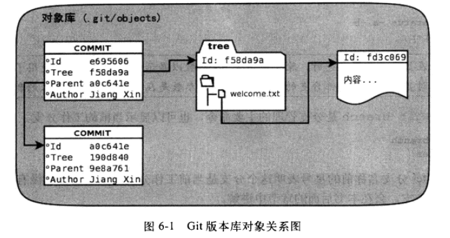

暂存区（stage|index）
-------
文件 .git/index 包含文件索引的目录树，记录了文件名和文件的状态信息（时间戳和文件长度等），文件索引建立文件和对象库中对象实体间对应

工作区、暂存区和版本库关系：

`git diff` 本地工作区和暂存区对比 
`git diff HEAD` 本地工作区和版本库对比 
`git diff --cached`或`git diff --staged` 暂存区和版本库对比

对象库
------------
目录 .git/objects 保存Git对象库(SHA1 ID前两位作为目录名，后38位为文件名) 
包含：commit对象，tree对象 
对象库对象间关系:

`git cat-file -t ID`
-t 查看对象类型 和 -p 查看对象内容

Blob对象
-----
保存文件内容
