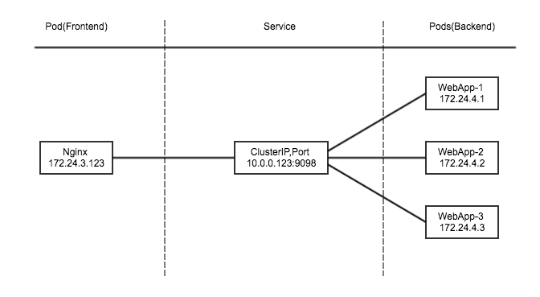
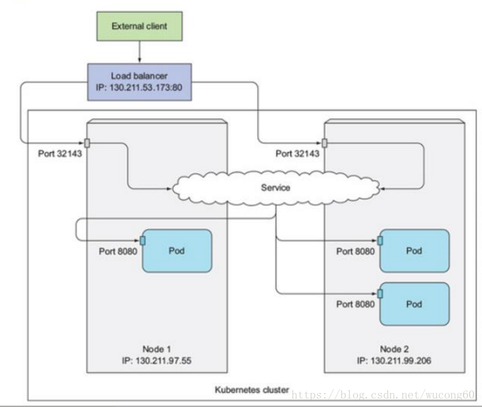

# Service
为支持集群的水平扩展、高可用性，对一组Pod抽象成Service，根据访问策略（如负载均衡策略）来访问Pod。(**service名称地址会被注册到DNS服务器上**) 
可以为一组具有**相同功能的容器应用提供一个统一的入口地址**，并将请求进行负载分发到后端的各个容器应用上。 

Service类型：(根据访问来源：1.k8s集群内部程序Pod 2.k8s集群外部) 
1. ClusterIP：提供一个集群内部的虚拟IP以供Pod访问(Service默认类型)
2. NodePort：在集群内部IP的基础上，在每个Node上打开一个端口供外部访问
3. LoadBalancer：通过外部负载均衡器来访问

负载分发策略： 
1. RoundRobin:轮询将请求转发到后端的各个Pod上，（默认情况下，k8s采用RoundRobin模式进行路由选择）
2. SessionAffinity:基于客户端IP地址进行会话保持模式（通过service.spec.sessionAffinity设置为ClientIP来启动sessionAffinity策略，**同一个客户端发来的请求就会建立一个session，并对应到后端固定的某个Pod上**）
3. **自定义负载分发策略**，通过Headless Service概念实现（即不给Service设置ClusterIP，仅通过Label Selector将后端的Pod列表返回给调用的客户端，客户端需要实现自己的负载分发策略，再确定具体访问哪个后端Pod）

ClusterIP
----------
pod间通过service访问：

NodePort
--------
k8s为每个Node上打开一个端口，作为主机端口映射（默认是：30000-32767）且每个Node的端口都一样，通过`NodeIP:NodePort`方式使得集群外部程序可以访问Service 
访问路径：client -> nodeIP:nodePort -> ClusterIP:servicePort -> podIP:podPort 

externalName
--------------
访问k8s集群外部服务

LoadBalancer
---------------
公有云环境：负载均衡node
