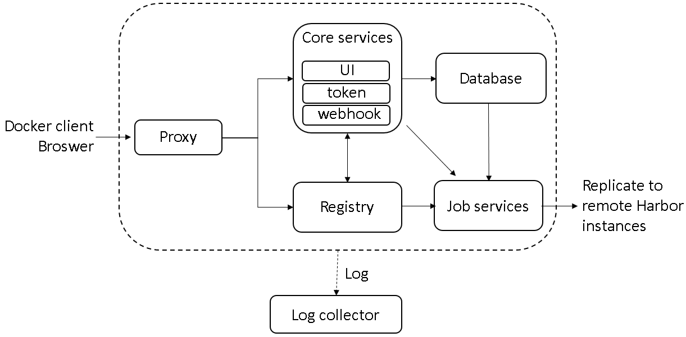

# 组件

* Proxy：nginx的前端代理，代理Harbor的registry,UI, token等服务。
* db：负责储存用户权限、审计日志、Dockerimage分组信息等数据。
* UI：提供图形化界面，帮助用户管理registry上的镜像, 并对用户进行授权。
* jobsevice：jobsevice是负责镜像复制工作的，和registry通信，从一个registry pull镜像然后push到另一个registry，并记录job_log。
* Adminserver：系统的配置管理中心附带检查存储用量，ui和jobserver启动时候回需要加载adminserver的配置。
* Registry：镜像仓库，负责存储镜像文件。
* Log：为了帮助监控Harbor运行，负责收集其他组件的log，供日后进行分析。
