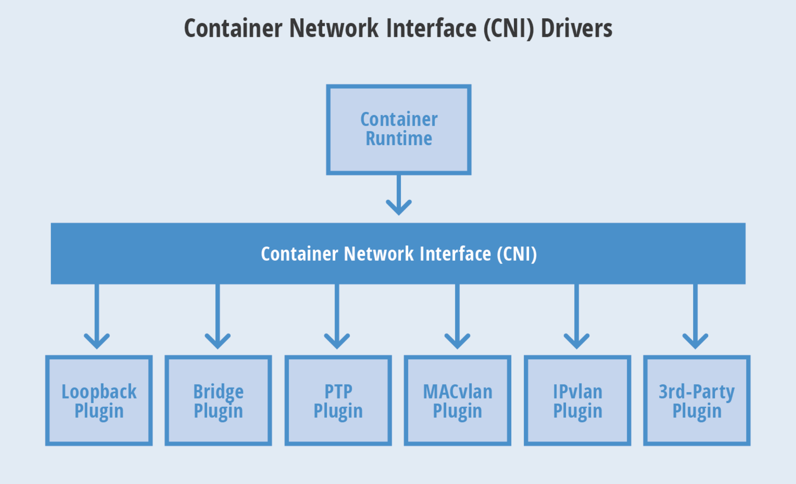

# CNI(Container Networking Interface)

CoreOS提出容器网络规范（CNI），使用插件模型创建容器网络栈。支持多种容器runtime 

kubernetes网络方案：Flannel、Calico、Canal、Weave Net等（网络模型一致，即每个Pod都有独立的IP，可直接通信。区别在于底层实现不同，或Vxlan的Overlay实现，或Underlay，或支持Network Policy） 

Flannel:覆盖网络，将TCP数据包装在另一中网络包里进行路由转发和通信，目前支持UDP、Vxlan、AWS VPC和GCE路由等数据转发方式 

网络插件配置：/etc/cni/net.d/ 

网络解决方案：
------------
1. 虚拟网桥
2. 多路复用：MacVLAN
3. 硬件交换：SR-IOV
