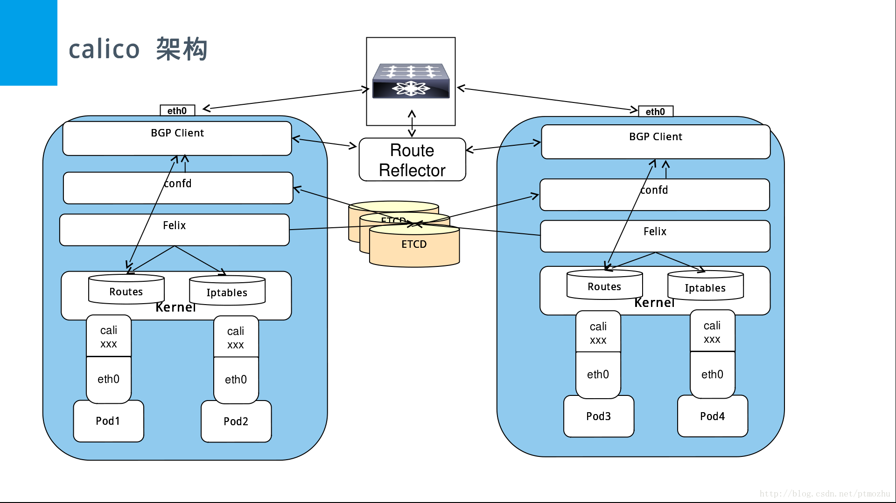

# 架构组件

组件
------
1. Felix，Calico Agent：跑在每台需要运行Workload的节点上，管理路由信息，**主要负责配置路由及ACLs等信息来确保Endpoint的连通状态**
2. etcd，分布式键值存储：**主要负责网络元数据一致性，确保calico网络状态的准确性（每个主机calico组件，提供容器interface管理，动态路由，动态ACL，报告状态等功能）**
3. BGP Client（BIRD）：虚拟路由间通过BGP协议同步节点上的Endpoint信息，**主要负责把Felix写入Kernel的路由信息分发到当前Calico网络，确保Workload间的通信的有效性**
4. BGP Route Reflector（BIRD）：大规模部署时使用，摒弃所有节点互联的mesh模式，通过一个或者多个BGP Route Reflector来完成集中式的路由分发
