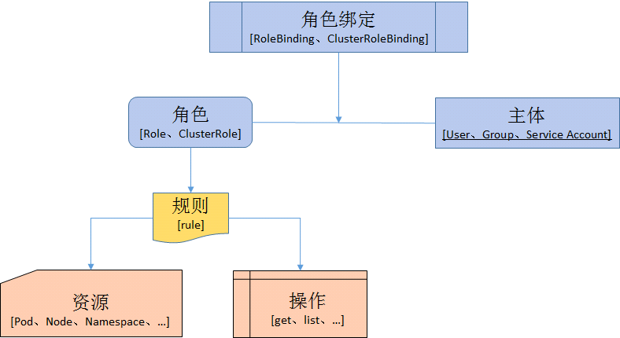

# 授权

API Server启动参数`--authorization_mode`设置

ABAC(基于属性的访问控制)
---------------------

RBAC（基于角色的访问控制）
--------------
**角色role绑定对象objects操作operations，用户user扮演角色。** 
1. 定义角色：定义角色指定此角色对资源的访问控制规则
2. 绑定角色：将主题与角色绑定，对用户进行访问授权

namespace级别： 
* role 
* rolebinding 

cluster级别:  
* clusterRole 
* clusterRoleBinding 

1. user：人使用
2. service Accout：进程使用

NODE（基于节点的访问控制）
--------------

WEB HOOK（自定义HTTP回调方法的访问控制）
---------------------
