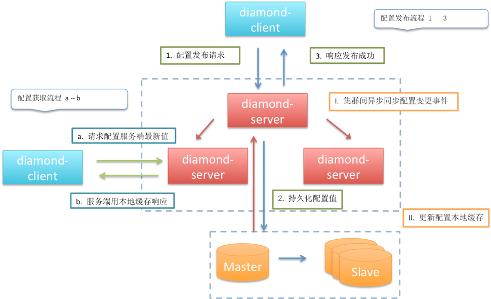

# diamond 分布式配置管理服务

* diamond-sdk：提供第三方应用的开发工具包，构建前台运维配置程序（所有访问操作直接面向数据库）
* diamond-utils
* diamond-server：diamond后端，处理配置的逻辑
    高可用配置中心。配置文件部署到server，工程项目监听配置，发现配置改动，重新加载配置 
    读请求都是访问localfile，写请求先进入数据库，接着更新各个节点缓存。（数据库保证数据原子性）
* diamond-client：所有子系统通过client组件对server访问（数据消费者）
    （防止集中故障瓶颈）client会在app端以文件形式缓存数据snapshot，保证即使server不可用app也可用

架构图：
------

原始问题：
--------
* 安全性：配置在源代码库里，容易配置泄露
* 时效性：修改配置，重启才能生效
* 局限性：无法支持动态调整，例如开关设置

配置中心特点
----------
* 配置增删改查
* 不同环境配置隔离（开发、测试、预发布、灰度线上）
* 高性能、高可用
* 请求量多，高并发
* 读多写少
