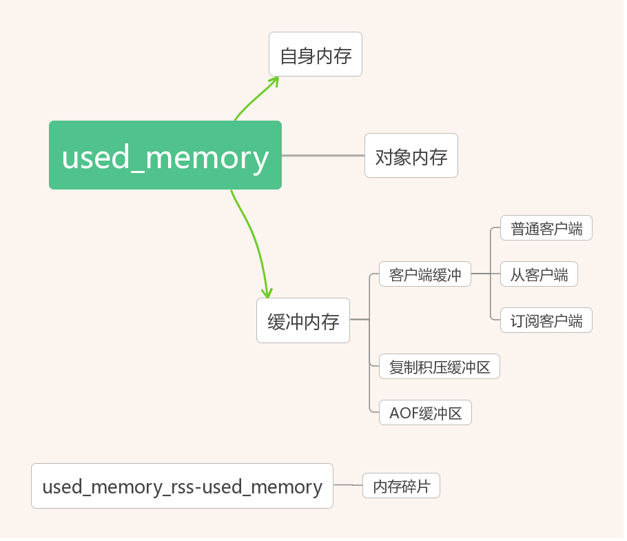

# 内存分配
内存分配图：

* 自身内存：redis运行自身使用内存
* 对象内存：用户数据
* 客户端缓冲：指所有接入到redis服务器TCP连接的输入输出缓冲。 
**输入缓冲无法控制，最大空间为1G，如果超过将断开连接**。 
**输出缓冲通过参数 client-output-buffer-limit控制**。 
**输入输出缓冲区在大流量的场景中容易失控，造成redis内存不稳定，需要重点监控**
  * 普通客户端缓冲：除了复制和订阅客户端之外所有连接 
  redis未对普通客户端的输出缓冲区做限制，一般内存消耗可忽略，但**当大量慢连接客户端接入时内存消耗就不能忽略，可设置 maxclients 限制**
  * 从客户端缓冲：主节点为每个从节点单独建立一条连接用于命令复制 
  **当主从节点间网络延迟较高或主节点挂载大量从节点时，内存消耗较大**，建议：主节点挂载不要多于2个，主从节点不部署在较差的网络环境下，如异地跨机房环境，防止复制客户端连接缓慢造成溢出
  * 订阅客户端缓冲：使用发布订阅功能时，连接客户端使用单独的输出缓冲区 
  **当订阅服务的消息生产快于消费速度时，输入缓冲区会产生积压造成缓冲区空间溢出**
* 复制积压缓冲区：Redis2.8后，提供的可重用固定大小缓冲区实现部分复制功能。积压队列参数设置 repl-backlog-size
* AOF缓冲区：redis重写期间保存最近写入命令。**用户无法控制，消耗内存取决于AOF重写时间和写入命令量，通常很小**

* 内存碎片 
  Redis默认的内存分配器采用jemalloc，
  在64位系统中将内存空间划分为：小、大、巨大三个范围。每个范围内又划分为多个小的内存块单位，如下所示： 
  * 小：[8byte]，[16byte，32byte，48byte，...，128byte]，[192byte，428256byte，...，512byte]，[768byte，1024byte，...，3840byte]
  * 大：[4KB，8KB，12KB，...，4072KB]
  * 巨大：[4MB，8MB，12MB，...] 
  **大量过期键删除，键对象过期删除后，释放的空间无法得到充分利用，导致碎片率上升。重启节点可以做到内存碎片重新整理，因此可以利用高可用架构，如Sentinel或Cluster，将碎片率过高的主节点转换为从节点，进行安全重启。**

子进程内存消耗
----------
指执行AOF/RDB重写时redis创建的子进程内存消耗。

注意：redis fork的子进程并不需要消耗1倍父进程内存，实际消耗根据期间写入命令量决定，要预留一些内存防止溢出 
**设置 sysctl vm.overcommit_memory=1 允许内核可以分配所有物理内存，防止redis进程执行fork时因系统剩余内存不足而导致失败** 
**排查当前系统是否支持并开启THP（Transparent Huge Pages），若开启建议关闭，防止copy-on-write期间内存过度消耗**
