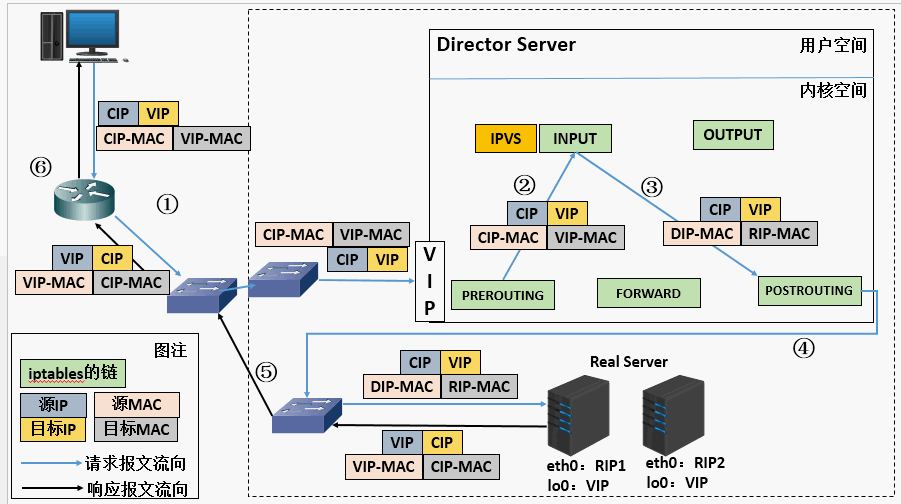

# DR 直接路由模式

思路：直接路由模式，减轻创建隧道连接增加的服务器负担，要求负载均衡设备和后端服务器必须在同一局域网内 
**负载均衡设备通过改写请求报文的目标MAC地址为RS的MAC地址（RS、DS在同一网段内）**，将请求发送到真实服务器。真实服务器将响应处理结果直接返回给客户端。 
极大提高集群的伸缩性，但LB和RS必须在同一局域网环境 

> RS可为公网地址，也可为私网地址。RS网关不能指向DS
> 所有请求报文经过DS，响应报文必须不通过DS（RS网关不允许指向DS）
