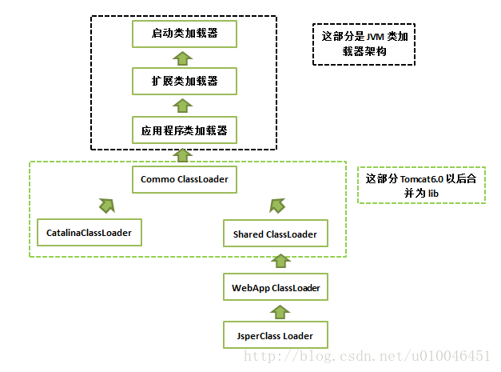

# 类加载器

* common类加载器 负责加载Tomcat应用服务器内部和Web应用均可见的类。common.loader,默认指向$CATALINA_HOME/lib下包
* catalina类加载器 负责加载只有tomcat应用服务器内部可见的类，对web应用不可见。server.loader,默认为空
* share类加载器 负责加载web应用共享的类。shared.loader,默认为空
* webApp类加载器 加载/WEB-INF/classes目录下的未压缩的class和资源文件及/WEB-INF/lib目录下的jar包

每个Web应用程序对应一个WebAppClassLoader 
每个JSP文件对应一个JspClassLoader
Servlet规范相关API禁止通过WebApp类加载器加载，不要在web应用中包含这些包

webApp类加载器 委派模式
-------------------
与默认委派模式稍有不同，当JVM基础类库外，会首先尝试通过当前类加载器加载，才进行委派 
默认加载顺序：
1. 从缓存中加载
2. 如果没有，则从JVM的Bootstrap类加载器加载
3. 如果没有，则从当前类加载器加载（按照WEB-INF/classes、WEB-INF/lib的顺序）
4. 如果没有，则从父类加载器加载，由于父类加载器采用默认委派模式，加载顺序为System->common->shared

> packageTriggersDeny 属性只让某些包路径采用Java委派模式，
webApp类加载器对于符合packageTriggersDeny指定的包路径的类强制采用Java的委派模式

tomcat类加载器 委派模式
----------------
delegate 属性控制是否启用Java委派模式，默认false（不启用） 
使用Java默认委派模式（true）：
1. 从缓存中加载
2. 如果没有，则从JVM的Bootstrap类加载器加载
3. 如果没有，则从父类加载器加载（System->Common->Shared）
4. 如果没有，则从当前类加载器加载
