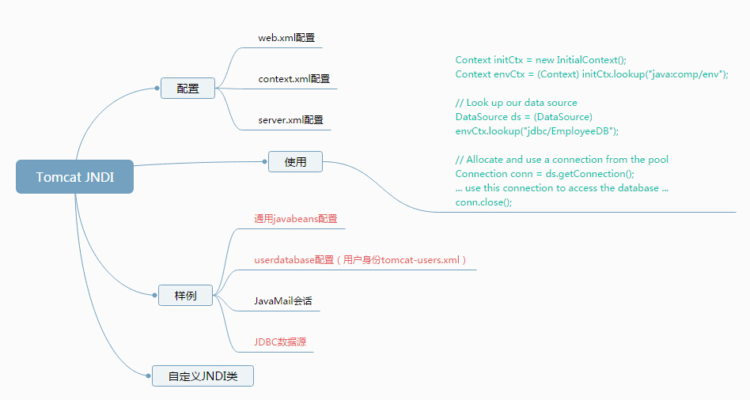

# tomcat JNDI配置

web.xml
---------
应用独有，配置资源引用

context.xml
-----------
1. conf/context.xml 所有应用通用，相比server.xml，区别为单独分离出来一个文件。 
2. WEB-INF/context.xml 应用自己的，如果不想把信息公开，放在此处

server.xml
---------
所有应用通用
