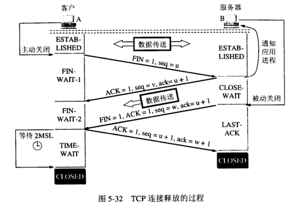

# TCP 传输控制协议

TCP属于面向连接，在进行数据通信前需要建立会话，并且同步数据包编号 

功能：
1. 流量控制

三次握手
-------
目的：保证连接可靠可用  
**ACK报文用来应答，SYN报文用来同步**
* 第一次握手：起初两端都处于CLOSED关闭状态，Client将标志位SYN置为1,随机产生一个值为seq=x，并将该数据包发送给Server,Client进入SYN-SENT状态，等待Server确认
* 第二次握手：Server收到数据包后由标志位SYN=1得知Client请求建立连接，Server将标志位SYN和ACK都置为1,ack=x+1,随机产生一个值seq=y，并将该数据包发送给Client以确认连接请求，Server进入SYN-RCVD状态，此时操作系统为该TCP连接分配TCP缓存和变量
* 第三次握手：Client收到确认后，检查ack是否为x+1,ACK是否为1,若正确则将标志位ACK置为1,ack=y+1,并且此时操作系统为该TCP连接分配TCP缓存和变量，并将该数据包发送给Server，Server检查ack是否为y+1,ACK是否为1,如果正确则建立连接成功，Client和Server进入ESTABLISHED状态，完成三次握手，随后Client和Server就可以开始传输数据。

> **Server端易受到SYN攻击:** 
SYN攻击就是Client在短时间内伪造大量不存在的IP地址，并向Server不断发送SYN包，Server则回复确认包，并等待Client确认，由于源地址不存在，因此Server需要不断重发直至超时，这些伪造的SYN包将长时间占用未连接队列，导致正常的SYN请求因为队列满而被丢弃，从而引起网络拥堵甚至系统瘫痪（Server端的资源分配是在二次握手时分配的，而Client的资源是在三次握手时分配的。）

四次挥手
------

1. 客户端A发送一个FIN，用来关闭客户端A到服务器B的数据传送
2. 服务器B收到这个FIN，它发回一个ACK，确认序号为收到的序号+1。
3. 服务器B关闭和客户端A的连接，发送一个FIN给客户端A
4. 客户端A发回ACK报文确认，并将确认序号设置为收到的序号+1

> **TCP连接为全双工，每个方向必须单独关闭。** 
**TIME_WAIT状态作用**：重发可能丢失的ACK报文（我们必须假想网络是不可靠的，无法保证最后发送的ACK报文一定被对方收到）
